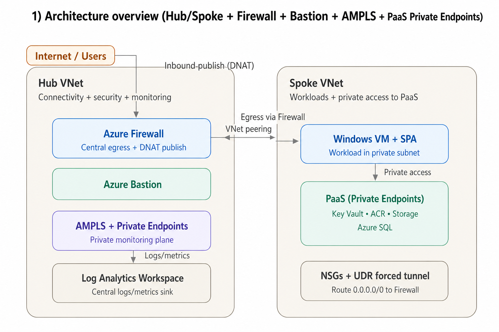

# Azure Landing Zone 

This repo is a Terraform-based Azure Landing Zone portfolio project showing **hub-and-spoke networking**, **centralized egress + inbound publish via Azure Firewall**, **Private Endpoints + Private DNS**, and **monitoring via Log Analytics + AMPLS**.

It’s designed to showcase clear architecture, clear traffic flows, and clear Terraform module structure.

---

## What this demonstrates

- **Hub/Spoke network**:
  - **Hub VNet**: shared services (Firewall, Bastion, monitoring plumbing - AMPLS + monitor PE + private DNS zones)
  - **Spoke VNet**: workloads (VM hosting a small SPA demo)
  - Hub↔Spoke peering
- **Centralized security & connectivity**:
  - Inbound traffic regulation via **Firewall Public IP + DNAT**
  - Outbound control via firewall (forced tunneling pattern via UDR)
  - **NSGs** for subnet segmentation
- **Private-first PaaS**:
  - PaaS services reachable via **Private Endpoints**
  - Correct **Private DNS Zones + VNet links** so workloads resolve to **private IPs**
- **Monitoring & logging**:
  - Central **Log Analytics Workspace**
  - **Azure Monitor Private Link Scope (AMPLS)** to keep monitoring traffic private (where supported/configured)

---

## Diagram 1 — High level architecture

---

## Diagram 2 — Request path / traffic flow (inbound + private service calls)

---

## Diagram 3 — Terraform module map (repo composition)

---

## Key design decisions

- **Hub/Spoke**: isolates shared services from workload VNets; scales to multiple spokes without reworking the hub.
- **Centralized egress**: outbound from workloads is inspected and controlled in one place (Azure Firewall).
- **Inbound publish via DNAT**: controlled exposure of a private workload without placing it on a public IP.
- **Private Endpoints + Private DNS**: avoids public exposure of PaaS; traffic stays on private networking end-to-end.
- **AMPLS**: monitoring/telemetry paths are kept private where supported.

---

## Private Endpoint DNS — why it matters

Private endpoints are only truly private if **DNS resolution is correct**.

How it works:
1. Workload queries the public service FQDN (e.g., Key Vault, Storage, SQL).
2. Private DNS zone (`privatelink.*`) returns an **A record** pointing to the **private endpoint NIC private IP**.
3. Workload connects to that private IP — traffic never leaves the private network.

> If DNS is misconfigured (missing zone or missing VNet link), workloads silently resolve the **public** endpoint and your private design breaks.

---

## Module Responsibilities

| Module | What it owns |
| :--- | :--- |
| **platform** | Core baseline primitives, shared resource group, backup services vault |
| **hub-network** | Hub VNet, subnets (firewall/bastion/PE), hub networking |
| **spoke-network** | Spoke VNet, workload subnets, NSGs, UDR/route tables, peering |
| **firewall-policies** | Firewall policy + rule collection groups (egress + DNAT) |
| **monitoring** | Log Analytics + AMPLS + private DNS links |
| **policies** | Governance policy definitions/assignments |
| **iam** | groups + RBAC/role assignment 
| **paas-resources** | PaaS resources + private endpoints + private DNS zones + links |
| **compute** | Workload VM (SPA demo), identity/login controls, diagnostics, backup |

---

## Remote Backend

- This project uses a remote backend (.tfstate stored in Azure Storage)
- I have deployed a stand-alone storage account, specifically for storing remote backend

---

